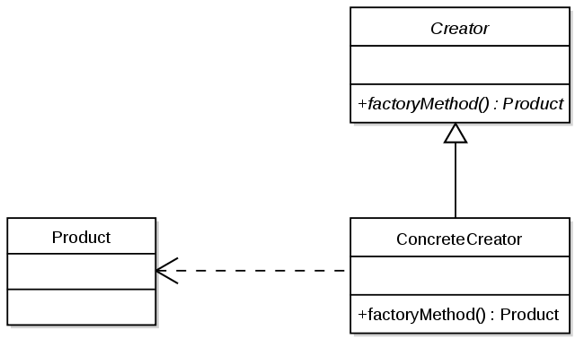

#Factory Method

* Factory Method е създаващ шаблон за дизайн, който се използва в обектно-ориентираното програмиране.
* Factory има за цел инстанцирането на различни обекти, чиито типове не са предефинирани.
* Обектите се създават динамично в зависимост от параметрите предадени на Factory.
* По принцип Factory e единствен в дадена програма, затова за създаването му често се използва шаблонът Singleton.

~~~c#
 // Factory Method pattern -- Structural example

  class MainApp
  {
    static void Main()
    {
      // An array of creators
      Creator[] creators = new Creator[2];
      creators[0] = new ConcreteCreatorA();
      creators[1] = new ConcreteCreatorB();

      // Iterate over creators and create products
      foreach(Creator creator in creators)
      {
        Product product = creator.FactoryMethod();
        Console.WriteLine("Created {0}",
          product.GetType().Name);
      }

      // Wait for user
      Console.Read();
    }
  }

  // "Product"

  abstract class Product
  {
  }

  // "ConcreteProductA"

  class ConcreteProductA : Product
  {
  }

  // "ConcreteProductB"

  class ConcreteProductB : Product
  {
  }

  // "Creator"

  abstract class Creator
  {
    public abstract Product FactoryMethod();
  }

  // "ConcreteCreatorA"

  class ConcreteCreatorA : Creator
  {
    public override Product FactoryMethod()
    {
      return new ConcreteProductA();
    }
  }

  // "ConcreteCreatorB"

  class ConcreteCreatorB : Creator
  {
    public override Product FactoryMethod()
    {
      return new ConcreteProductB();
    }
  }
~~~